```{r setup, include=FALSE}
knitr::opts_chunk$set(echo = TRUE)
```

## Introduction

Spotify has developed various functionalities to allow third parties access to the music library from the applications that they developed. In addition, Spotify have classified songs based on 10 attributes that characterize them, for example, the positivity that a song transmit, their liveness or tempo.

This combination of features allow to know more about the musical tastes in several countries. The main objective is to find correlations between the lists of most listened songs in the countries that Spotify has in its catalog and other indicators that characterize these countries.

Working on this project I hope to find similarities between the most heard songs in different countries and continents. On this way, and by combining this information with the meteorological or social indicators I also expect to understand and find reason about why people from different countries listen these kind of music in Spotify... What can songs tell us about people in the world? 

Here we go!

## First steps

Before starting to work with songs data you have to follow some previous steps. The first thing we need is create a Spotify account. If you already are a free or Premium Spotify user you only have to log in your account, if not you will need to register a new account and complete the registration process. I will omit the registration steps because it is out of the scope of this project.

### Creation of a Spotify developer account 

Once you have created an Spotify account you should access to the following website: https://developer.spotify.com/dashboard/
and log in with your Spotify user credentials. You will access to your own dashboard and have the possibility to create new apps in which you could use their API.

Next step it is to create a SPOTIFY_CLIENT_ID, first you will have to select "Create Client ID" in your upper right zone and fill the form suggested by Spotify. Once you have your public key you are ready to create your first Spotify app selecting "Create New App" button (see image below). Each app will provide you of a SPOTIFY_CLIENT_SECRET ID, therefore, using this ID and your SPOTIFY_CLIENT_ID you will have a way to conect your client application with Spotify system in order to extract the required data.

```{r Dashboard Screenshot, echo=FALSE , out.width = '100%'}
 

```

In addition, there is one more step to follow in our newly created app. For certain functions and applications, you’ll need to log in as a Spotify user. To do this, your Spotify Developer application needs to have a callback url. You can set this to whatever you want that will work with your application, but a good default option is http://localhost:1410/ (see image below).

```{r Dashboard Screenshot_2, echo=FALSE , out.width = '75%'}
 

```

### Spotifyr: Installation & Authentication 

Once you set up a Dev account with Spotify you will be able to access their Web API here. This will give you your Client ID and Client Secret. Once you have those codes, you can pull your access token into R with get_spotify_access_token().

The easiest way to authenticate is to set your credentials to the System Environment variables SPOTIFY_CLIENT_ID and SPOTIFY_CLIENT_SECRET. The default arguments to get_spotify_access_token() (and all other functions in this package) will refer to those. Alternatively, you can set them manually and make sure to explicitly refer to your access token in each subsequent function call.

```{r spotifyr, message=FALSE}
#install.packages("spotifyr)
#install.packages("dplyr")
library(dplyr)
library(spotifyr)

#Sys.setenv(SPOTIFY_CLIENT_ID = 'xxxxxxxxxxxxxxxxxxxxx')
#Sys.setenv(SPOTIFY_CLIENT_SECRET = 'xxxxxxxxxxxxxxxxxxxxx')

#access_token <- get_spotify_access_token()
```

The main functionality of spotifyr package is to pull the metadata associated to the songs hosted in Spotify application. Using the functions developed in this package you will be able to get the features of the songs. Nevertheless, before starting with the feature analysis you will need to find some songs datasets. In this project, some data wrangling process has been implemented in order to obtain relevant datasets, therefore, a Spotify functionality called Spotify Charts (https://spotifycharts.com/regional) was used to download songs datasets in .csv files. It has been decided to use Spotify Charts because it hosts the TOP 200 more listened songs in more than 50 countries in a weekly or even daily range. You can see in the image below all the countries which belongs to the Spotify enviroment.

```{r Worldmap Screenshot, echo=FALSE , out.width = '100%'}
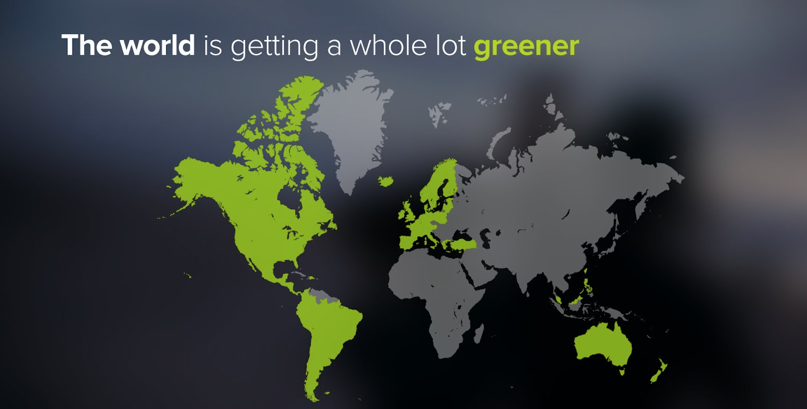 

```

## Wrangling raw data

The data wrangling process begins at this point from Spotify Charts website. The plan is to build a automatic Web
Scrapping process which download all songs dataset for every country hosted in the app. You have to decided also for the data time range which you want to download between daily or weekly range. The historical data begins in 01/01/2017 until
nowadays.

In this project it has been decided to download the data in a weekly range because it will be easier to differenciate the seasons every year and also for future analysis.

A function was created which call up to Spotify Charts web and download .csv for every available country and every
data range. Once the data is downloaded, the info about TOP200 songs is merged in one single dataframe. You can
see and example in the following code, however you can see this process in detail checking "02_WebScrapping_Weekly.R" file which can be found in the repository.

For this example, we put a limitation in the number of countries and only one two weeks are being downloaded, but it 
is enough to see how the process works. The whole dataset it is included in the /data folder.

```{r libraries_1, echo=TRUE, eval=TRUE, message =FALSE}

library(tidyverse)
library(lubridate)
library(readr)

```

Definition of used variables: 

```{r}
#A short example of the Web Scrapping Process

url_prefix <- 'https://spotifycharts.com/regional/'
url_middle <- '/weekly/'
url_suffix <- '/download'

start_date_2017 <- as.Date("2016/12/30")
end_date_2017 <- as.Date("2017/01/06")

id_spotify <- c("global", "us", "gb", "ar", "at", "au",
                "be", "bg", "bo", "br", "ca")

descr <-    c("Global", "UnitedStates", "UnitedKingdom", "Argentina",
               "Austria", "Australia", "Belgium", "Bulgaria", "Bolivia", "Brazil",
               "Canada")

```

Web Scrapping process example:

```{r WebScrappingProcess, echo = TRUE, eval= FALSE}
date <- start_date_2017 # set data counter
top200_df <- data.frame("Position","Track.Name","Artist","Streams","URL")
top200_df_2017<- data.frame() # initialize empty df

i = 1
  for (i in 1:length(zones$id_spotify)) {
    while (date <= end_date_2017) {
      print(str_c("Processing ", date," ", zones$descr[i]))
      # Concat the current data frame with new data
      top200_df_2017 <- top200_df_2017 %>% rbind(pull_top200(zones$id_spotify[i],date))
      date <- date + 7
      }
  i <- i+1
date <- start_date_2017
    }
```

Output:
```{r WebScrappingOutput, echo=FALSE}
zones <- data.frame(id_spotify,descr)
top200_df <- data.frame("Position","Track.Name","Artist","Streams","URL")
col_names = c("Position","Track.Name","Artist","Streams","URL")


pull_top200 <- function(zone,date_ini) {
  
  # Create the URL target
  urls <- str_c(url_prefix,zone,url_middle,format.Date(date_ini),"--",format.Date(date_ini+7),url_suffix)

  # Pull data from Spotify
  tryCatch( {
    top200_df <- read.csv(urls, skip = 1) 
  } ,  error = function(e) {
    top200_df <- data.frame("Position","Track.Name","Artist","Streams","URL")
    message("No data for this country/dates")
    print(e)})
  
  # There are sometimes file that do not exist, this handles the exception
  ifelse(all(colnames(top200_df) %in% col_names),
         top200_df <- top200_df %>% mutate(Date = date_ini, Zone = zone), # Create a date attribute
         top200_df <- data.frame()) # Return an empty data frame if invalid
  
  top200_df
}

# And get 2017 top 200 songs by country. If there is a file that it does not exists, the process will skip to the 
#next week

    date <- start_date_2017 # set data counter
    top200_df <- data.frame("Position","Track.Name","Artist","Streams","URL")
    top200_df_2017<- data.frame() # initialize empty df
    i = 1
    for (i in 1:length(zones$id_spotify)) {
      while (date <= end_date_2017) {
        print(str_c("Processing ", date," ", zones$descr[i]))
        # Concat the current data frame with new data
        top200_df_2017 <- top200_df_2017 %>% rbind(pull_top200(zones$id_spotify[i],date))
      date <- date + 7
      }
    i <- i+1
    date <- start_date_2017
    }

```


Spotify has defined a system according to which it classifies its songs in 10 attributes with a value between 0.0 and 1.0 according to its characteristics. A description of audio features can be found in "info_feature_description.r" file inside the github repository

Once you have the info about track_names, artists, number of streams and zone which can be found in Spotify Charts, it's time to pull metadata from the songs using Spotifyr library and their functions.

Then, all artist in df will be extracted and using get_artist_audio_features() you could extract every track info including the features of every track of each artist. 


```{r WebScrappingOutput_read, echo=TRUE, message=FALSE}

top200_df_all <- read_csv("data/top200songs.csv")
head(top200_df_all)

```

Then, all artist in df will be extracted and using get_artist_audio_features() you could extract every track info including the features of every track of each artist. 

See below the number of artists which belong to any TOP200 in all countries anaylize in the last 2 years and 4 months.

```{r ArtistScrapping_2, echo=TRUE, eval= TRUE}
artists <- top200_df_all$artist_name%>% unique()
artists[1:50]
```

Once you have the info about track_names, artists, number of streams and zone which can be found in Spotify Charts, it's time to pull metadata from the songs using Spotifyr library and its function get_artist_audio_features over the artist list obtained in the previous step

```{r ArtistScrapping_3, echo=TRUE, eval=FALSE}

max_tries = 1

# Pull song metadata
for (try in 1:max_tries) {
  remaining_artists <- c()

  for (i in 1:length(artists)) {
    print(str_c("Processing Artist: ", artists[i], " ", i, " of ", length(artists), " pass: ", try))
    succeed = FALSE

    tryCatch({
      # Select and join the artist's tracks with top 200
      tracks <- get_artist_audio_features(artists[i]) %>% # Get the artist's albums
        #mutate(artist_name = artists[i]) %>% # Add the artist's name
        filter(track_name %in% top200_df_all$track_name) %>% # Filter only tracks that are in top200
        rbind(tracks)
      succeed = TRUE
      print("Done!")
    }, error = function(e) { print(e) })

    # If the pull did not succeed, add the artist to the remaining artist list
    if (!succeed) {
      remaining_artists <- c(remaining_artists, artists[i])
    }
  }
  artists <- remaining_artists
}
```

At this point you should have two dataframes, one with the info about the TOP200 per country and week (top200_df_all) and another one with all feature songs from the artist that can be found in all TOP200 lists. So, it's time to merge
both dataframe, so you will have a single dataframe with TOP200 songs per country including their features.

```{r dataframe_final_merge, echo=TRUE, eval=FALSE}
top200_df_tracks_ <- top200_df_all %>% left_join(tracks_all)

```

After some cleaning data process that can be found inside the dedicated file in the repository you will get a dataframe
like this:

```{r dataframe_final_show, echo= FALSE, eval= TRUE, message= FALSE}
top200_df_tracks_vf_ <- read_csv("data/top200_vf.csv")
```

```{r dataframe_final_show_2, echo= TRUE, eval= FALSE}
top200_df_tracks_vf_ <- read_csv("data/top200_vf.csv")
```

Finally, this dataset will be the point of reference for this project and almost all future analysis will include this
info.

```{r dataframe_final_show_3, echo= TRUE, eval= TRUE}
top200_df_tracks_vf_

```

## Summary

Starting with the songs dataset, the following sections will present some relevant info obtained in the dataset by itself and also will combine this data with other interesting dataset in order to study possible relationships between
the TOP200 songs which was listened in these countries and weather variables or happiness ranking by country.

### Feature analysis

In this sections, the songs dataset will be analyzed, so let's check what data can tell us about the analyzed countries and artists!

First of all, let check the correlation between features 

```{r correlation, echo= TRUE, eval= TRUE, message=FALSE}

library(ggplot2)
library(corrplot)
library(forcats)
library(gridExtra)

#Spotify The streaming music giant now reportedly pays $0.00437 per play.
#sources: https://www.digitalmusicnews.com/2018/12/25/streaming-music-services-pay-2019/

revenue_per_stream = 0.00437

#Songs that have generated more revenues
tracks_by_revenue <- top200_df_tracks_vf_ %>% 
  filter(Zone == "global") %>% 
  group_by(track_name, artist_name) %>% 
  mutate(revenue = streams * revenue_per_stream) %>% 
  summarise_each (funs(sum), sum_rev = revenue) %>% 
  arrange(desc(sum_rev))


#This is a common analysis for all countries so it will be filter by zone = global
track_by_feature <- top200_df_tracks_vf_ %>% 
  filter(Zone == "global") %>% 
  group_by(track_name, artist_name) %>% 
  summarise_at(vars("avg_danceability","avg_energy","avg_loudness","avg_speechiness","avg_acousticness",
                    "avg_instrumentalness","avg_liveness","avg_valence","avg_tempo","avg_duration_ms"), funs(mean))

#matching both df for feature analysis
tracks_joins <- data.frame()
tracks_joins<- left_join(tracks_by_revenue, track_by_feature)
spotify_features <- tracks_joins[,-(1:3)] %>% 
  na.omit()

mtCor <- cor(spotify_features)
corrplot(mtCor, method = "ellipse", type = "upper", tl.srt = 60)

```

It seems like energy and loudness are highly positively correlated. Also, valence is positively correlated with danceability and energy. The relation between danceability/energy/valence can be observed in the following density graph:

```{r density, echo= FALSE, eval= TRUE, message=FALSE}
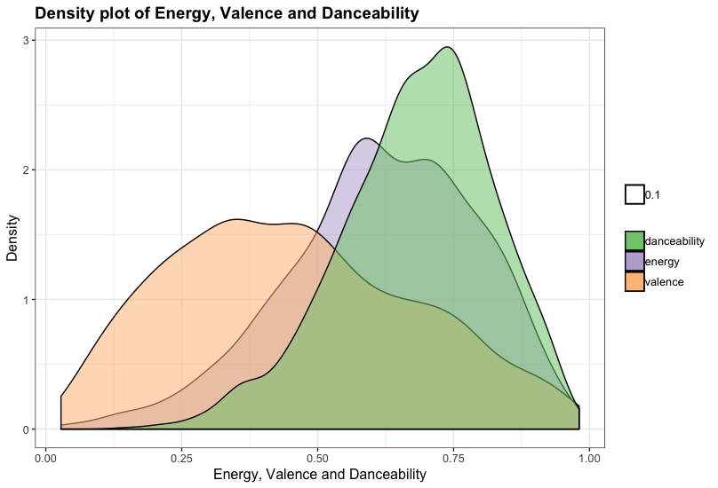 
```

Putting some emphasis on the features of the whole set of more listened songs, this would be the distribution by feature and their respective average values. It can be checked approximately which parameteres are needed
to be a success song, but of course they are not the only ones!

```{r distribution, echo= TRUE, eval= TRUE, message=FALSE}

pan_energy <- ggplot(data = tracks_joins[-1,], mapping = aes(y = sum_rev)) +
  geom_bin2d(aes(x = avg_energy), na.rm = TRUE) +
  scale_fill_continuous(low = "khaki1", high = "red") +
  theme_bw()

pan_valence <- ggplot(data = tracks_joins[-1,], mapping = aes(y = sum_rev)) +
  geom_bin2d(aes(x = avg_valence), na.rm = TRUE) +
  scale_fill_continuous(low = "khaki1", high = "red") +
  theme_bw()

pan_dance <- ggplot(data = tracks_joins[-1,], mapping = aes(y = sum_rev)) +
  geom_bin2d(aes(x = avg_danceability), na.rm = TRUE) +
  scale_fill_continuous(low = "lightblue", high = "midnightblue") +
  theme_bw()

pan_speech <- ggplot(data = tracks_joins[-1,], mapping = aes(y = sum_rev)) +
  geom_bin2d(aes(x = avg_speechiness), na.rm = TRUE) +
  scale_fill_continuous(low = "lightblue", high = "midnightblue") +
  theme_bw()

pan_acous <- ggplot(data = tracks_joins[-1,], mapping = aes(y = sum_rev)) +
  geom_bin2d(aes(x = avg_acousticness), na.rm = TRUE) +
  scale_fill_continuous(low = "mistyrose", high = "magenta4") +
  theme_bw()

pan_live <- ggplot(data = tracks_joins[-1,], mapping = aes(y = sum_rev)) +
  geom_bin2d(aes(x = avg_liveness), na.rm = TRUE) +
  scale_fill_continuous(low = "mistyrose", high = "magenta4") +
  theme_bw()
```

```{r distribution_image, echo= FALSE, eval= TRUE, message=FALSE}
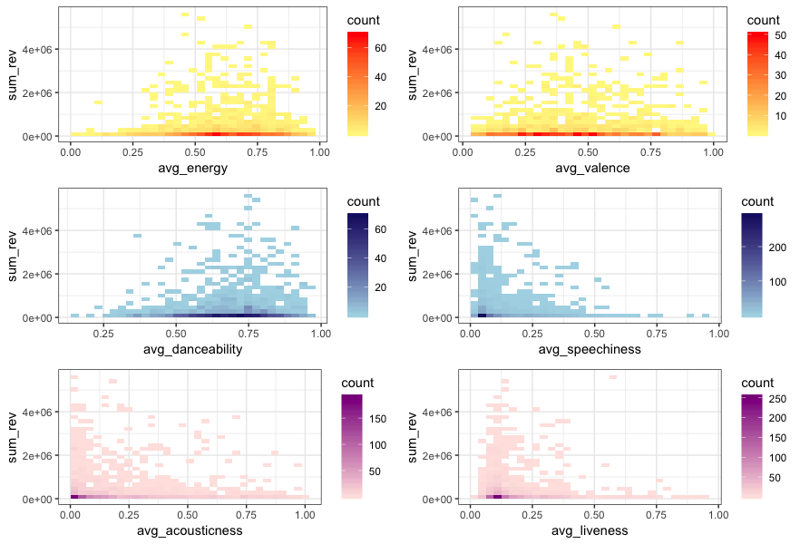 
```

Regarding the TOP artist, starting in our main dataset you can see some interesting info. Here You can see the artist with more number of hits in the 500 more listened song list in the world through the last 2 years and a half.

```{r artist, echo= TRUE, eval= TRUE, message=FALSE}

df_global <- top200_df_tracks_vf_ %>% 
  filter(Zone == "global") %>% 
  group_by(track_name, artist_name) %>% 
  na.omit() %>% 
  summarise_at(vars(starts_with("streams")), list(sum_streams = sum), na.rm =TRUE) %>% 
  arrange(desc(sum_streams)) %>% 
  unique()

df_features_global <- top200_df_tracks_vf_ %>% 
  filter(Zone == "global") %>% 
  na.omit() %>% 
  select(track_name, artist_name,avg_danceability,avg_energy,avg_loudness,avg_speechiness,avg_acousticness,avg_instrumentalness
         ,avg_liveness,avg_valence,avg_tempo,avg_duration_ms) %>% 
  unique()

df_songs_pop <- left_join(df_global, df_features_global)

df_songs_pop$artist_name <- as.factor(df_songs_pop$artist_name)

more_hits_artist <- df_songs_pop[1:500,] %>% 
  group_by(artist_name) %>% 
  summarise(numero = n()) %>% 
  arrange(desc(numero))

more_hits_artist[1:10,] %>% 
  mutate(artist_name = fct_reorder(artist_name, numero)) %>%
  ggplot( aes(x=artist_name, y= numero)) +
  geom_bar(stat = "identity", fill = "steelblue2") +
  ggtitle("TOP 10 Artists with more hits streamed in 2017/2018/2019") +
  coord_flip() +
  theme_bw()

```

SO...IT'S DRAKE!

```{r gif1, echo= FALSE, eval= TRUE, message=FALSE}
 

```

But if you check who's the artist which earn more money in the last 2 year and a half due to the number of
streaming... SORRY DRAKE, you are not the winner, it is POST MALONE.

```{r revenue, echo= TRUE, eval= TRUE, message=FALSE}
more_revenues_artist <- df_songs_pop %>% 
  group_by(artist_name) %>% 
  summarise(revenues = sum(sum_streams)) %>% 
  arrange(desc(revenues))

more_revenues_artist[1:10,] %>% 
  mutate(artist_name = fct_reorder(artist_name, revenues)) %>%
  ggplot( aes(x=artist_name, y= revenues)) +
  geom_bar(stat = "identity", fill = "steelblue2") +
  ggtitle("TOP 10 Artists who earned more money based on Spotify streamings in 2017/2018/2019") +
  coord_flip() +
  theme_bw()
```

```{r gif2, echo= FALSE, eval= TRUE, message=FALSE}
 

```

Anyway DRAKE earned a lot of money as he's the second one in the list.

```{r gif3, echo= FALSE, eval= TRUE, message=FALSE}
 

```

If you want more details about the code, please check "03_Features_analysis.R" file

### Feature analysis per country

In this section it will be added a new variable to consider and compare beside the songs features, the countries where these songs were listened. Which are the countries who listen songs with more energy? 
and what about the valence? In the next paragraphs we can see what data says about each feature.

```{r percountryLibraries , echo= TRUE, message=FALSE}


library(gridExtra)
library(countrycode)
library(plyr)
library(maps)
library(ggiraph)
library(ggplot2)
library(gdata)
library(widgetframe)


  evalString <- function(s) {
    eval(parse(text = s), parent.frame())
  }


feature_by_year_top <- function(anio, feature) {
  
    top200_df_tracks_vf_ %>% 
    select(Zone, year, feature) %>% 
    filter(year == anio) %>% 
    group_by(Zone,year) %>% 
    na.omit() -> countries_df
 
   evalString <- function(s) {
   eval(parse(text = s), parent.frame())
   }
  countries_df <- ddply(countries_df,'Zone',summarise, mean = mean(evalString(feature))) %>% 
  arrange(desc(mean))

  countries_zone <- as.character(toupper(countries_df$Zone)) 
  countries_df$Zone <- countrycode(countries_zone, "iso2c", "country.name", nomatch = "GLOBAL")
  countries_df$Zone[countries_df$Zone == "United States"] <- "USA"
  countries_df$Zone[countries_df$Zone == "United Kingdom"] <- "UK"
  countries_df$Zone[countries_df$Zone == "Czechia"] <- "Czech Republic"
  
  countries_df
}

feature_map_interactive <- function(anio, feature) {
  
  map_countries <- feature_by_year_top(anio, feature)
  
  WorldData <- map_data('world')
  WorldData %>% filter(region != "Antarctica") -> WorldData
  
  WorldData$value <- map_countries$mean[match(WorldData$region, map_countries$Zone)]
  
    g <- ggplot(WorldData) + 
     geom_polygon_interactive(
       color='white',
       aes(long, lat, group=group, fill=value,
           tooltip=sprintf("%s<br/>%s",region, round(value,digits = 3)))) +
    scale_fill_continuous(
                          low =  "yellow", 
                          high = "red4", 
                          guide= "colourbar") +
    theme_bw(base_size = 20)  + 
    labs(fill = feature ,title = paste("World Map by", toupper(feature)), 
         subtitle = paste("Year of analysis:",anio), x="", y="") +
    scale_y_continuous(breaks=c()) + 
    scale_x_continuous(breaks=c()) + 
    theme(panel.border =  element_blank())
   
    widgetframe::frameWidget(ggiraph(code=print(g), width = 1 ,width_svg = 20, height_svg = 10))
}

```


```{r perCountry_dance, echo= TRUE, eval=FALSE}

feature <- "avg_danceability"
map_dance_2017 <- feature_by_year_top("2017",feature)

map_dance_2017 <- map_dance_2017[1:5,] %>% 
  ggplot(aes(reorder(Zone,-mean),mean)) +
  geom_bar(stat = "identity", fill = "steelblue2") +
  geom_text(aes(label = paste(round(mean,2),"%")), size = 5, hjust = 0.5, vjust = 3, position ="stack") +
  ggtitle("Danceability - 2017") +
  xlab("Zones") +
  theme_bw()

map_dance_2018 <- feature_by_year_top("2018",feature)
map_dance_2018 <- map_dance_2018[1:5,] %>% 
  ggplot(aes(reorder(Zone,-mean),mean)) +
  geom_bar(stat = "identity", fill = "indianred2") +
  geom_text(aes(label = paste(round(mean,2),"%")), size = 5, hjust = 0.5, vjust = 3, position ="stack") +
  ggtitle("Danceability - 2018") +
  xlab("Zones") +
  theme_bw()


map_dance_2019 <- feature_by_year_top("2019", feature)
map_dance_2019 <- map_dance_2019[1:5,] %>% 
  ggplot(aes(reorder(Zone,-mean),mean)) +
  geom_bar(stat = "identity", fill = "khaki2") +
  geom_text(aes(label = paste(round(mean,2),"%")), size = 5, hjust = 0.5, vjust = 3, position ="stack") +
  ggtitle("Danceability - 2019") +
  xlab("Zones") +
  theme_bw()


danceability_panel <- grid.arrange(map_dance_2017, map_dance_2018,map_dance_2019)
```


**DANCEABILITY**

France and Dominican Republic seems to be the countries who's gone further into dance mode. 


```{r dance, echo=FALSE}
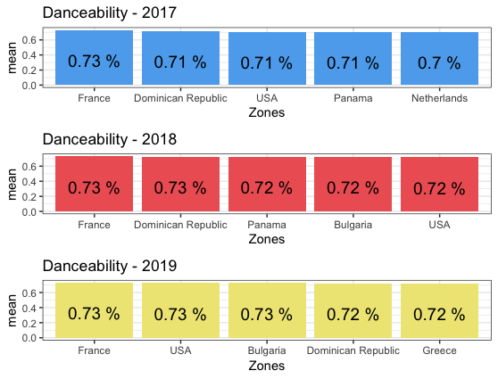 

```


**ENERGY**

Naturally, Latin countries like Uruguay and Peru are heading de country list who listen song with high values of energy, but Japan is also in the list! Maybe this can be a consequence of the influence of their local songs which seems to be full of energy... or maybe not :/

```{r energy, echo=FALSE}
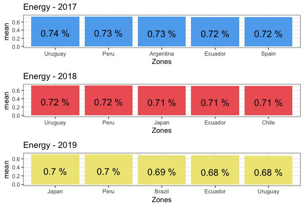 

```


```{r energy2, include = FALSE}
knitr::opts_chunk$set(widgetframe_widgets_dir = 'widgets' ) 
feature = "avg_energy"
feature_map_interactive("2018", feature)

```

```{r energy3, echo=TRUE}

feature = "avg_energy"
feature_map_interactive("2018", feature)
```

*More interactive maps like this can be found inside "04_Feature_Analysis_per_countries.R" file in the repository.


**VALENCE ANALYSIS**

South America countries clearly listen more positive and "happy" songs as they complete almost the whole list since 2017.

```{r valence, echo=FALSE}
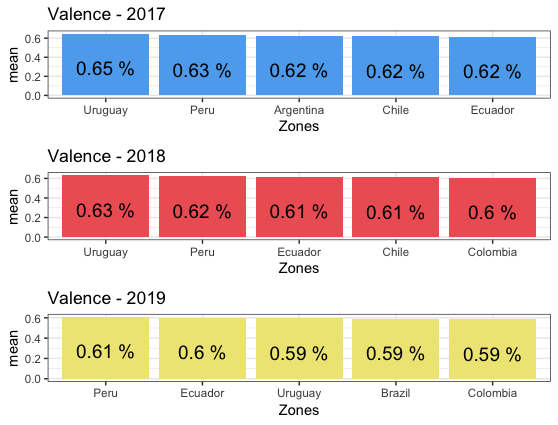 

```


```{r valence4, include = FALSE}
knitr::opts_chunk$set(widgetframe_widgets_dir = 'widgets' ) 
feature = "avg_valence"
feature_map_interactive("2018", feature)

```

```{r valence5, echo=TRUE}

feature = "avg_valence"
feature_map_interactive("2018", feature)
```


**SPEECHINESS ANALYSIS**

It can be observed that German people and USA listen songs with more speech content than others countries as they are included in these list.

```{r Speechiness, echo=FALSE}
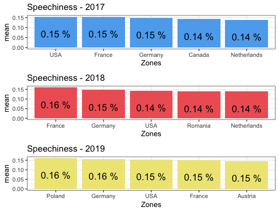 

```


**TEMPO**

So, Brazil again makes the difference regarding the songs with highest tempo.

```{r tempo, echo=FALSE}
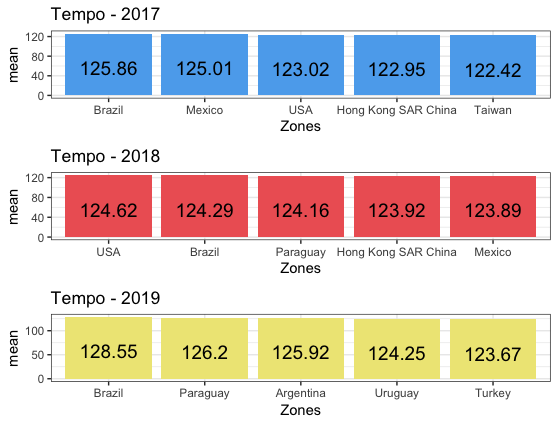 

```


**LOUDNESS**

Uruguay and Japan hold the top places in the Loudness list.


```{r Loudness, echo=FALSE}
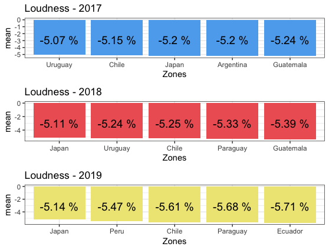 

```


**INSTRUMENTALNESS ANALYSIS**

South Africa people likes Instrumentalness songs in their playlist more than other countries. You should consider that Spotify Charts don't have data about the songs listened by South africans in 2017, this is the reason because we don't expect any data from them in 2017.

```{r Instrumentalness, echo=FALSE}
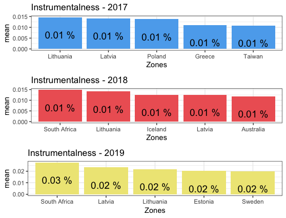 

```


### Weather vs features analysis

At this moment we have the characteristics of the songs most listened around more than 50 countries during the last two and a half years ... but also by cultural factors, is it possible that other variables such as meteorological variables are influencing in the type of music more heard from a country? Sure of that, but, how much is it affecting?

In this section, firstly it will be seen how to download weather information per countries and months, for this concrete action it will be taken info of every station registered in the data source. After it, the information obtained will be relationate with the songs dataset which are being used in previous analysis.

Weather information was obtained from the National Climatic Data Center of the United States (ftp://ftp.ncdc.noaa.gov/pub/data/ghcn/daily/by_year/). The information has been downloaded and subsequently processed following the interests of our analyzes.

```{r weatherload, echo=TRUE, eval=FALSE}

library(ggplot2)
library(lubridate)
library(gdata)
library(readr)
library(dplyr)
library(plyr)
library(countrycode)

#FTP Source
# ftp://ftp.ncdc.noaa.gov/pub/data/ghcn/daily/by_year/ - NOAA's National Climatic Data Center (NCDC) 
# 

#info with all countries represented
weather_countries <- read.delim('data/ghcnd-countries.txt', sep = "", header = FALSE, col.names = c("COUNTRY_ID","COUNTRY1", "COUNTRY2", "COUNTRY3"))  
#info with all Weather Station represented
weathers_stations  <- read.delim('data/ghcnd-stations.txt', sep = "", header = FALSE)  

#info with data collected by the weather stations year by year
weather_2017 <- read.table('data/2017.csv.gz', sep = ",", header = FALSE, col.names = c("ID", "DATE", "ELEMENT", "DATA_VALUE", "M-FLAG", "Q-FLAG", "S-FLAG", "OBS-TIME"))    
weather_2018 <- read.table('data/2018.csv.gz', sep = ",", header = FALSE, col.names = c("ID", "DATE", "ELEMENT", "DATA_VALUE", "M-FLAG", "Q-FLAG", "S-FLAG", "OBS-TIME"))   
weather_2019 <- read.table('data/2019.csv.gz', sep = ",", header = FALSE, col.names = c("ID", "DATE", "ELEMENT", "DATA_VALUE", "M-FLAG", "Q-FLAG", "S-FLAG", "OBS-TIME"))  

```

Let's check if there is any correlation with the valence feature which represent the musical positiveness conveyed by a track. Is there any relationship between valence and rain?  If a country has a lot of precipitation, then will their people listen to music with less valence than other countries? Let's try to answer these questions


```{r weatherplot, echo=TRUE, eval=FALSE}

feature <- "avg_valence"
valence_2017 <- feature_by_month("2017",feature) %>% 
  dplyr::rename(
    COUNTRY_DESC = Zone)

valence_2018 <- feature_by_month("2018",feature) %>%
  dplyr::rename(
    COUNTRY_DESC = Zone)

valence_2019 <- feature_by_month("2019",feature) %>%
  dplyr::rename(
    COUNTRY_DESC = Zone)

valence_all <- rbind(valence_2017,valence_2018,valence_2019)

precip_valence <- left_join(valence_all, weather_mx) %>% 
  na.omit()

precip_valence$continent <- countrycode(sourcevar = precip_valence[, 1],
                                                        origin = "country.name",
                                                        destination = "continent")

corr_ <- precip_valence %>% 
  group_by(COUNTRY_DESC) %>% 
  summarise(correl = cor(mean, AVG_PRCP)) 

precip_valence_as <- precip_valence %>% 
  filter(continent == "Asia")
precip_valence_as <- left_join(precip_valence_as,corr_)

#code example for Asia graph

asia_rl <- ggplot(precip_valence_as, aes(x = MONTH)) +
     facet_wrap(paste("R=",round(correl,2)) ~ COUNTRY_DESC) +
     geom_line(aes(y = mean, colour = "Valence")) +
     geom_line(aes(y = AVG_PRCP/300, colour = "Precipitations")) +
     # annotate("text", x= as.Date("2017-05-01") , y=0.68, label= cor, size = 1) +
     scale_y_continuous(sec.axis = sec_axis(~.*300, name = "avg_prcp")) +
     scale_colour_manual(values = c("blue", "red")) +
     labs(y = "Valence",
              x = "Month",
              colour = "Variables") +
     theme(legend.position = c(0.8, 0.9)) +
     theme_bw()

```
*The whole code can be found into "05_weather_analysis.R" in the repository


```{r asia, echo=FALSE}
knitr::include_graphics("images/Asia_valence_prcp.png") 

```


```{r America, echo=FALSE}
knitr::include_graphics("images/america_valence_prcp.png") 

```


```{r Europe, echo=FALSE}
knitr::include_graphics("images/Europe_valence_prcp.png") 

```


```{r Oceania, echo=FALSE}
knitr::include_graphics("images/oceania_valence_prcp.png") 

```


By checking this graph it can be seen the correlation month by month between the valence and the precipitations happened in the last two years and a half. The reason because it's been comparing month by month and not anually it's simple as doesn't rain the same in every month, specially in the places where they have seasonal rains,
so if it had been taken an anual measure will be totally different.

### Hapiness ranking vs feature analysis

The World Happiness Report is a landmark survey of the state of global happiness that ranks 156 countries by how happy their citizens perceive themselves to be.

I wonder if there is any relation between the "happiest" countries, in other words, the countries with the highest score in the World Hapiness report and the music they listen...

```{r happiness0, echo=TRUE, eval=FALSE}

#loading data
all_tracks <- top200_df_tracks_vf_
hapiness_2017 <- read_csv("data/WorldHappiness2017_Data.csv")
hapiness_2018 <- read_csv("data/WorldHappiness2018_Data.csv")

#cleaning process can be checked in the dedicated file "06_Hapiness.R"

#2017
hapiness_2017
feature <- "avg_valence"
map_valence_2017 <- dance_by_year_top("2017",feature) %>% 
    dplyr::rename(
    Country = Zone)

happiness_vs_valence_2017 <- left_join(hapiness_2017,map_valence_2017) %>% 
  na.omit()

happiness_vs_valence_2017 <- happiness_vs_valence_2017 %>% 
  select(Country, Score, mean)

happiness_vs_valence_2017_df <- data.frame(happiness_vs_valence_2017$Country)
happiness_vs_valence_2017$continent <- countrycode(sourcevar = happiness_vs_valence_2017_df[, 1],
                            origin = "country.name",
                            destination = "continent")

ggplot(happiness_vs_valence_2017, aes(x=Score,y=mean, label = Country, colour = continent)) +
      geom_point() +
      geom_text(aes(label=Country),hjust=0, vjust=0) +
      scale_x_continuous(name = "Hapiness Score") +
      scale_y_continuous(name = "Valence") +
      ggtitle("2017 - Valence VS Hapiness") +
      theme_bw() 

hapiness_2018
feature <- "avg_valence"
map_valence_2018 <- dance_by_year_top("2018",feature) %>% 
  dplyr::rename(
    Country = Zone)

happiness_vs_valence_2018 <- left_join(hapiness_2018,map_valence_2018) %>% 
  na.omit()

happiness_vs_valence_2018 <- happiness_vs_valence_2018 %>% 
  select(Country, Score, mean)

happiness_vs_valence_2018_df <- data.frame(happiness_vs_valence_2018$Country)
happiness_vs_valence_2018$continent <- countrycode(sourcevar = happiness_vs_valence_2018_df[, 1],
                                                   origin = "country.name",
                                                   destination = "continent")

ggplot(happiness_vs_valence_2018, aes(x=Score,y=mean, label = Country, colour = continent)) +
  geom_point() +
  geom_text(aes(label=Country),hjust=0, vjust=0) +
  scale_x_continuous(name = "Hapiness Score") +
  scale_y_continuous(name = "Valence") +
  ggtitle("2018 - Valence VS Hapiness") +
  theme_bw() 

```


```{r r hapiness_1, echo=FALSE}
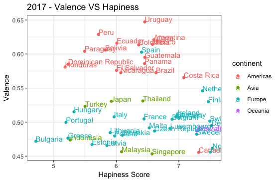 
```


```{r r hapiness_2, echo=FALSE}
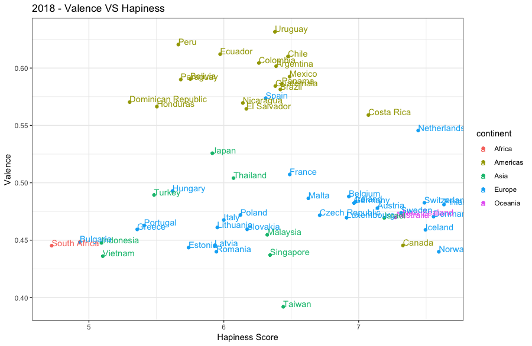 
```


Apparently, South America's countries and Spain listened the songs with high values of valences... let check how the valence of these songs are distributed for instance in year 2018.


```{r hapiness_3, echo=TRUE, eval=FALSE}
happiness_vs_song_valence_2018_am <- happiness_vs_song_valence_2018 %>% 
  filter(continent == "Americas")

c_density_am <- ggplot(happiness_vs_song_valence_2018_am) +
  facet_wrap(paste("Score=",round(Score,2))~Country) +
  geom_density(aes(avg_valence, fill ="valence")) + 
  scale_x_continuous(name = "Valence") +
  scale_y_continuous(name = "Density") +
  ggtitle("2018 - Density plot of Valence VS Hapiness Score ") +
  theme_bw() +
  theme(plot.title = element_text(size = 14, face = "bold"),
        text = element_text(size = 12)) +
  theme(legend.title=element_blank()) +
  scale_fill_brewer(palette="Accent")

c_density_am
```


```{r r hapiness_4, echo=FALSE}
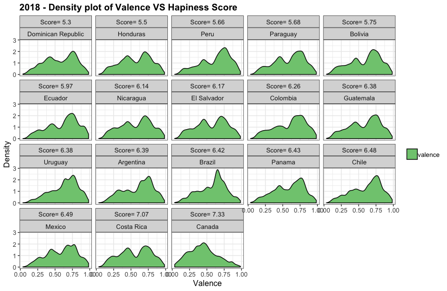 
```

Checking density i.g. in America continent you can see that countries with higher values in Valence like Canada or Costa Rica are not having the highest values in the valence of their songs.


Can a linear regression model explain between valence and hapiness in the countries from the same continents?

```{r hapiness_5, echo=TRUE, eval=FALSE}


#LINEAR REGRESSION 
ggplot(happiness_vs_valence_2018, aes(x=Score,y=mean, label = Country, colour = continent)) +
  geom_point() +
  geom_text(aes(label=Country),hjust=0, vjust=0) +
  stat_smooth(method = "lm") + 
  scale_x_continuous(name = "Hapiness Score") +
  scale_y_continuous(name = "Valence") +
  ggtitle("Valence VS Hapiness") +
  theme_bw() 


```


```{r r hapiness_8, echo=FALSE}
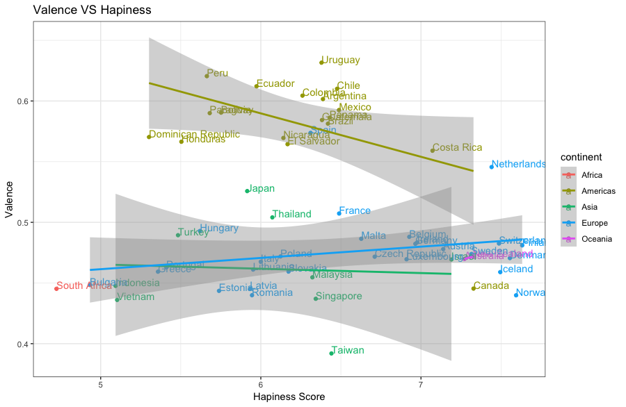 
```


Finally let see and check how k-means works and group the countries using three clusters

```{r hapiness_6·, echo=TRUE, eval=FALSE}

#CLUSTERING
ggplot(happiness_vs_valence_2018, aes(x=Score,y=mean, label = Country, colour = continent)) +
  geom_point() +
  geom_text(aes(label=Country),hjust=0, vjust=0) +
  scale_x_continuous(name = "Hapiness Score") +
  scale_y_continuous(name = "Valence") +
  ggtitle("Valence VS Hapiness") +
  theme_bw() 


features_h <- c('Score', 'mean')
n_clusters <- 3
country_clusters <- kmeans(happiness_vs_valence_2018[, features_h], n_clusters, nstart = 30)

happiness_vs_valence_2018$cluster <- factor(country_clusters$cluster)

centroids <- data.frame(cluster = factor(seq(1:n_clusters)),
                        Score = country_clusters$centers[,'Score'],
                        mean = country_clusters$centers[,'mean'])

# cross tab of countries by cluster
print(table(happiness_vs_valence_2018$cluster, happiness_vs_valence_2018$continent))


g <- ggplot() + 
  geom_point(data = happiness_vs_valence_2018, 
             aes(x = Score, 
                 y = mean,
                 color = cluster),
             size = 3) +
  geom_text(data = happiness_vs_valence_2018,
            aes(x = Score,
                y = mean,
                label = Country, hjust=0, vjust=0,
                color = cluster))+
            # nudge_y = .2,
            # check_overlap = TRUE)
   geom_point(data = centroids,
              mapping = aes(x = Score,
                            y = mean,
                            color = cluster),
              size = 20,
              pch = 13) 

print(g)
```


```{r r hapiness_7, echo=FALSE}
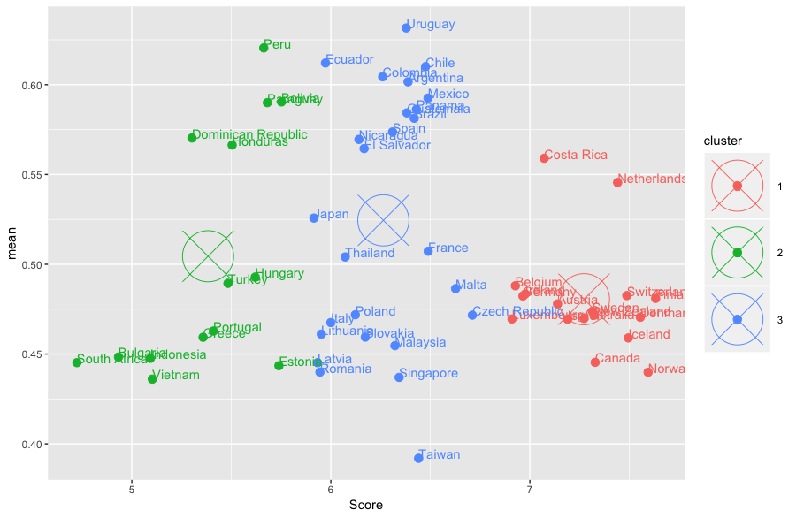 
```


*The whole code can be found into "06_Hapiness.R" in the repository

### Sucess songs analysis

The last step in the scope of this study is to build a classifer which can predict if a song will be a hit song or not based in the values of their atributes.First of all it is necessary to define a target, so based on the dataset it has been decided to considered the top 25% more listened songs as a Worldwide popular song.

```{python Sucess_0, echo=TRUE, eval = FALSE, python.reticulate = FALSE}

#taking feature between 0 and 1

features = ["avg_acousticness", "avg_danceability", "avg_energy", "avg_instrumentalness","avg_liveness", 
          "avg_speechiness", "avg_valence"]
          
X = df[features]
y = df['target']

X_train, X_test, y_train, y_test = train_test_split(X, y, test_size=0.10, random_state=242)

XGB_Model = XGBClassifier(objective = "binary:logistic", n_estimators = 10, seed = 123)
XGB_Model.fit(X_train, y_train)
XGB_Predict = XGB_Model.predict(X_test)
XGB_Accuracy = accuracy_score(y_test, XGB_Predict)

print("Accuracy: " + str(XGB_Accuracy)+"%")
print(classification_report(y_test,XGB_Model.predict(X_test)))

Accuracy: 0.7474048442906575%
             precision    recall  f1-score   support

          0       0.75      1.00      0.86      1081
          1       0.33      0.00      0.01       364

avg / total       0.64      0.75      0.64      1445

```

Logistic Regresion and XGBoost provided the best predictions on the training model

```{r sucess_1, echo=TRUE}
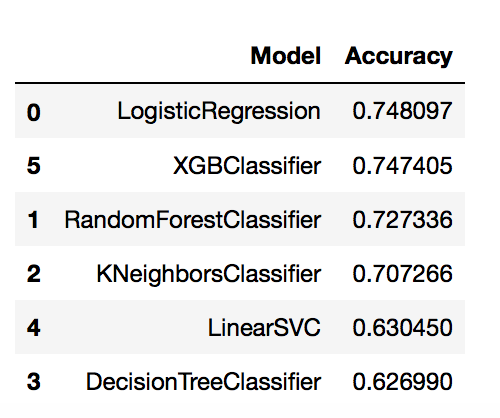 
```

```{python Sucess_2, echo=TRUE, eval = FALSE, python.reticulate = FALSE}

print(XGB_Model.feature_importances_)

# plot
plt.bar(colnames, XGB_Model.feature_importances_)
plt.show()

```


```{r sucess_3, echo=FALSE}
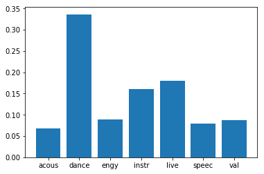 
```


*The whole code can be found into "07_Success_prediction_1.R" and "08_07_Success_prediction_1.ipynb" in the repository

## Conclusion

Data showed some interesting things and allow to affirm some clear information. Regarding the correlation between the features, considering happy songs usually make people feeling good and they are suitable for dancing , the correlation make a lot sense.Interestingly, acoustiness is highly negative correlated with energy and loudness as a acoustic song usually is softly perfom.

Generally, it can be affirm that exists some unknown variables out of the scope of this analysis that clearly affect to he most listened playlist of each country. The influence of precipitations in the valence of the songs cannot be demostrate as the correlation between both variables was very weak in almost every country and continent. An example of this can be represented in South America, one of the regions where more precipitations events happened but the songs they listen are quite positive by far.

Another interesting assumption than can be done it is than Spanish speaking people listen more positive, danceable and energetic songs as this can be seen in more than one graph. In my opinion, besides the language, this can be a consequence of the latin origin of the people of these countries whose musical taste are very close.

Regarding the possibility that happiest countries could listen happiest songs this has not been demostrated. There are different approaches in this analysis. If you have a look in the continental analysis, regarding Americas, the more thirsty the country is, the happier music they listen. In Europe you can see that it is happening the opposite as countries worse considerated by the World Hapiness report listen low valence songs on average.

The opportunity to predict if a song is going to be a global hit or not based on their attributes is not clear. After testing different classifier I have come to he conclusion that it is easier to predict not popular songs than popular songs. Maybe they are not enough complex models but the obtained results make sense with the data and charts that it has been presented in this project, because additionally to their attributes, the fact that a song became one of the most listened songs in the world, it depend a lot of the cultural factor of each country and this is a difficult thing to measure...

Thank your for your attention :)